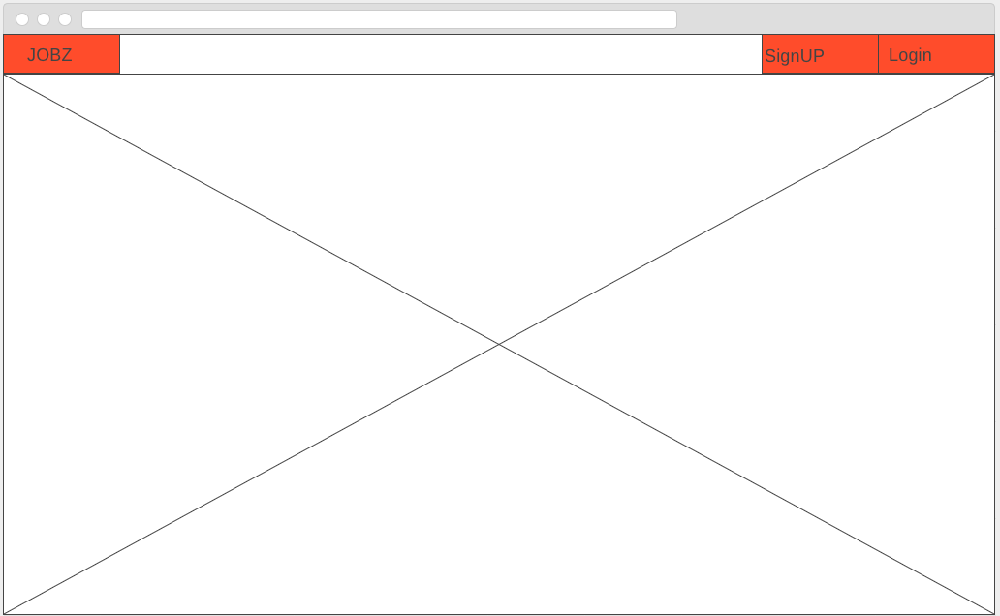
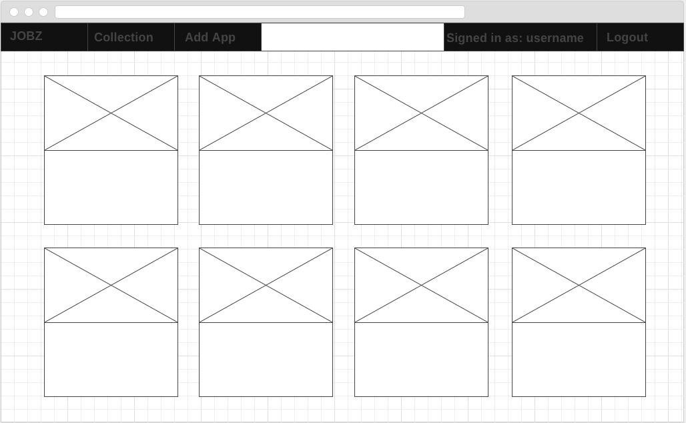
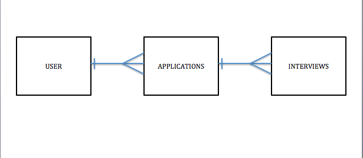

# JOBZ #
https://jobzapp.herokuapp.com/

## Description and Motivation
Jobz is a simple application built to track job applications and interviews in one place. It prompts users to fill out useful information to make their job tracking easy and efficient.

## Link to Project Trello ##
https://trello.com/b/eC23vMOH/jobz

## Technologies ##
  - HTML and EJS
  - Semantic UI
  - CSS
  - Node.js
  - Express
  - MongoDB and Mongoose
  - OAuth

## Prototype Main Page ##

## Prototype Collection Page ##

## Entity Relationship Diagram ##

## Example Routes ##

| URL                           | HTTP VERB     | ACTION  | DESCRIPTION          |
| -------------                 |:-------------:| -----:  | -------------        |        
| /login                        | GET           | SHOW    | show login form      |
| /signup                       | GET           | SHOW    | show signup form     |
| /new                          | GET           | SHOW    | show application form|
| /new                          | POST          | ADD     | Add an application   |
| /application/:id/edit         | GET           | SHOW    | Show edit form       |
| /application/:id              | PUT           | UPDATE  | Update an application|
| /application/:id              | DELETE        | DELETE  | delete an application|

## Stretch Goals User Stories ##

Add the interview functionality to the app and make a dynamic landing page with React.js
